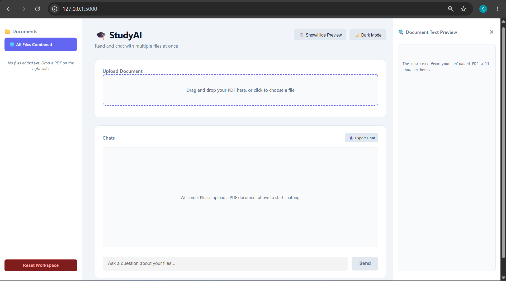
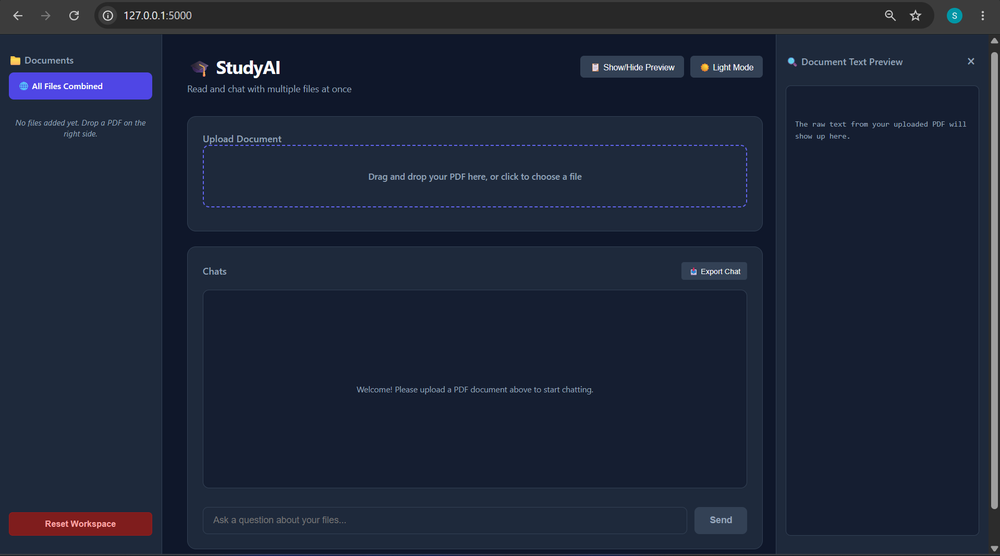

# 🎓 StudyAI

StudyAI is a clean, minimal, and distraction-free AI-powered study workspace where students can upload PDF study materials and interact with them intelligently through chat.

Designed for focus and productivity, StudyAI allows users to query individual files or search across multiple documents simultaneously while keeping the interface simple and clutter-free.

---

## ✨ Features

### 📚 Multi-File Chat Integration

* Chat with a single PDF or all uploaded files together
* Cross-reference information between multiple study materials

### 🧹 Distraction-Free Workspace

* Toggle sidebar visibility anytime
* Hide raw extracted text panels for focused studying

### 💡 Smart Suggestion Chips

* Automatically generates clickable study prompts after file parsing

### 📝 Session Notes Exporter

* Download your complete chat session as a `.txt` file

### 🔄 Workspace Reset

* Instantly clear uploaded files and session data

### 🎨 Responsive UI

* Smooth dark/light theme support
* Mobile-friendly responsive layout
* Modern slide-and-fade animations

---

# 🛠️ Tech Stack

| Layer          | Technology                      |
| -------------- | ------------------------------- |
| Backend        | Python, Flask                   |
| PDF Processing | PyPDF2                          |
| AI Integration | Google GenAI SDK                |
| Model          | `gemini-3.5-flash`              |
| Frontend       | HTML5, CSS3, Vanilla JavaScript |

---

# 🚀 Installation & Setup

## 1️⃣ Clone the Repository

```bash
git clone https://github.com/sathidevivaraprasadreddy/StudyAI.git
cd StudyAI
```

---

## 2️⃣ Install Dependencies

Make sure Python is installed on your system.

```bash
pip install flask PyPDF2 google-genai python-dotenv
```

---

## 3️⃣ Configure Environment Variables

Create a file named `.env` in the root directory.

```env
GEMINI_API_KEY=your_actual_api_key_here
```

---

## 4️⃣ Run the Application

```bash
python app.py
```

Open your browser and visit:

```text
http://127.0.0.1:5000
```

---

# 📂 Project Structure

```text
StudyAI/
│
├── app.py
├── uploads/
├── templates/
│   └── index.html
│
├── static/
│   ├── style.css
│   └── script.js
│
├── .env
├── .gitignore
└── README.md
```

---

# 🔒 Security

Never push your `.env` file to GitHub.

Add this to `.gitignore`:

```gitignore
.env
```

---

# 📸 Screenshots

## Main Dashboard



## Dark Theme



---

# 🌟 Future Enhancements

* OCR support for scanned PDFs
* AI-generated flashcards
* Quiz generation system
* Voice assistant integration
* User authentication
* Cloud sync support

---

# 🤝 Contributing

Contributions are welcome.

1. Fork the repository
2. Create a new branch
3. Commit changes
4. Push the branch
5. Open a Pull Request

---

# 📄 License

This project is licensed under the MIT License.

---

# ⭐ Support

If you found this project useful, give it a star ⭐ on GitHub.
